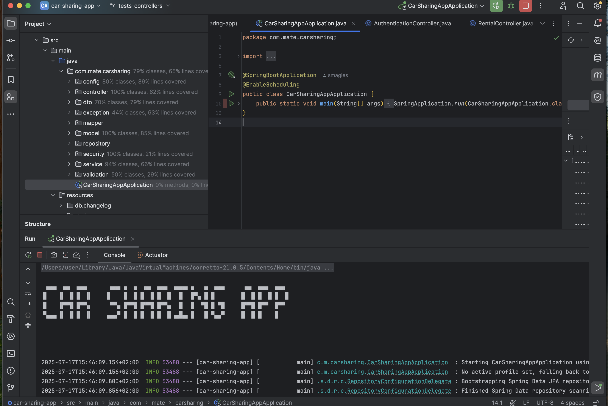
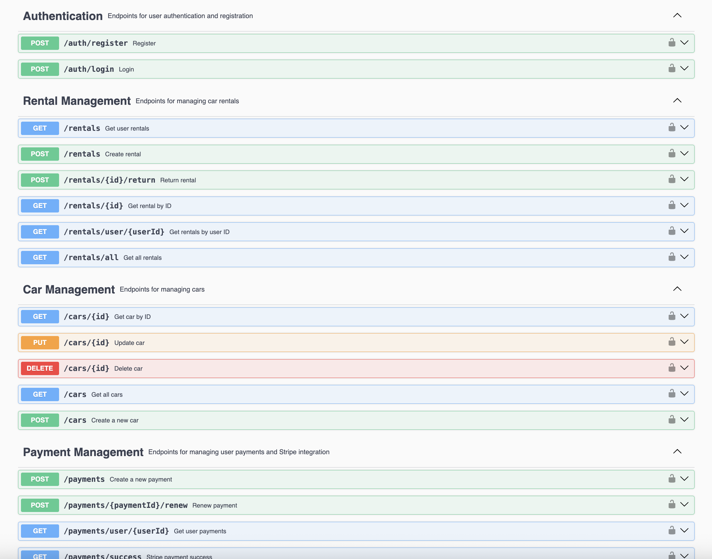

# 🚘 Car Sharing Application

A modern car-sharing platform built with  **Spring Boot** that enables users to rent vehicles, manage payments via  **Stripe**, and receive  **Telegram** notifications


## ⚙️ Tech Stack

### Backend
-  **Java 21** - Core language
-  **Spring Boot 3.5.0** - Application framework
-  **Spring Security** - 🔐 Authentication & authorization
-  **JWT** - Secure token-based authentication
-  **MapStruct** - Efficient DTO mapping
-  **Liquibase** - Database migrations
-  **MySQL** - Primary database (H2 for testing)
-  **Docker** – Containerization for deployment and testing
-  **Maven** – Project build and dependency management
-  **JUnit 5** – Unit testing framework


### Integrations
-  **Stripe API** - Payment processing
-  **Telegram Bot API** - Real-time notifications
-  **SpringDoc OpenAPI** - API documentation
-  **GitHub Actions** – CI/CD pipelines

## 📌 About

This is a **learning project** where I’ve developed a backend for a car-sharing platform.  
The application allows users to:

- Rent cars and track their bookings
- Manage payments using **Stripe**
- Receive real-time updates through **Telegram notifications**
- Register and log in securely with JWT authentication
- Use role-based access for **users** and **managers**

## 🚀 Getting Started

### Environment Variables

The application uses the following environment variables:

| Variable              | Default value                                  | Description                          |
|-----------------------|------------------------------------------------|--------------------------------------|
| `JWT_EXPIRATION`      | `21600000`                                     | JWT expiration in milliseconds       |
| `JWT_SECRET`          | `my-very-strong-secret-32-chars-long-1234`    | Secret key used to sign JWT tokens   |
| `TELEGRAM_BOT_TOKEN`  | `your-bot-token`                               | Token for Telegram Bot               |
| `TELEGRAM_CHAT_ID`    | `12345678`                                     | Chat ID used by Telegram Bot         |
| `STRIPE_SECRET_KEY`   | `your-stripe-key`                              | Stripe API secret key                |


#### 1. Clone the repository:
    ```bash
    git clone https://github.com/smagles/car-sharing-app


#### 2. Database Setup

##### Option 1: Docker (Recommended)
    ```bash
    # Start all services in detached mode
    docker-compose up -d

    # Verify containers are running
    docker ps

##### Option 2: Manual MySQL Setup


#### 3. Service Configuration

##### Telegram Bot
    ```properties
    telegram.bot.username=your-bot-name 
    telegram.bot.token=your-bot-token
    telegram.bot.chat.id=your-chat-id

##### Stripe Payments
    ```properties
    stripe.secret.key=your-secret-key




## 📚 API Documentation
Access Swagger UI after launch:
🔗 http://localhost:8080/swagger-ui/index.html

